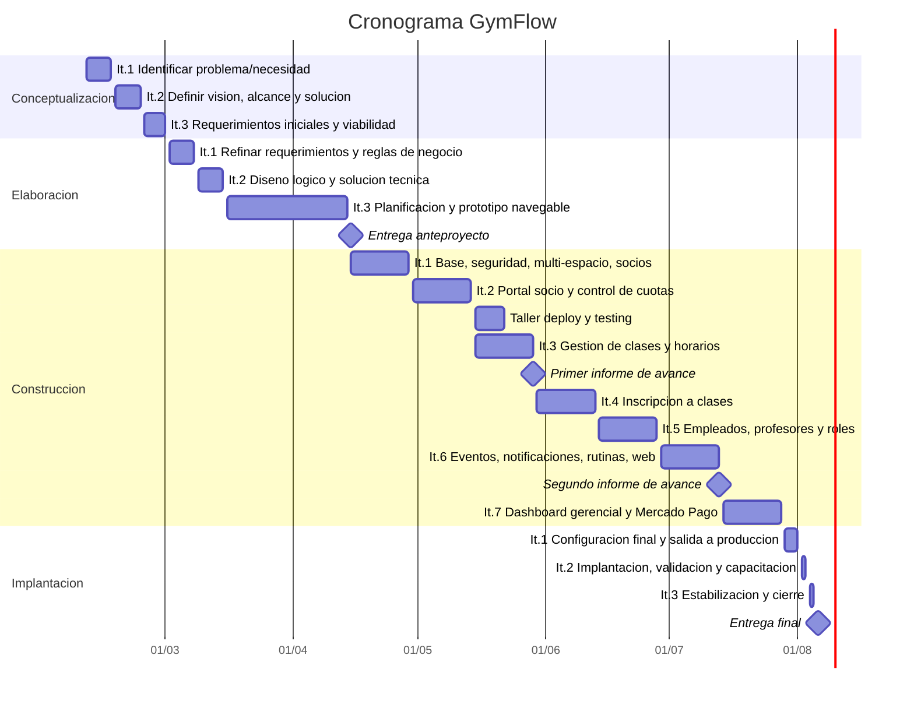

# Cronograma - Diagrama de Gantt

```mermaid
gantt
    title Cronograma GymFlow
    dateFormat YYYY-MM-DD
    axisFormat %d/%m

    section Conceptualizacion
    It.1 Identificar problema/necesidad           :c1, 2026-02-10, 2026-02-16
    It.2 Definir vision, alcance y solucion        :c2, 2026-02-17, 2026-02-23
    It.3 Requerimientos iniciales y viabilidad      :c3, 2026-02-24, 2026-03-01

    section Elaboracion
    It.1 Refinar requerimientos y reglas de negocio :e1, 2026-03-02, 2026-03-08
    It.2 Diseno logico y solucion tecnica           :e2, 2026-03-09, 2026-03-15
    It.3 Planificacion y prototipo navegable         :e3, 2026-03-16, 2026-04-14
    Entrega anteproyecto                            :milestone, m1, 2026-04-15, 0d

    section Construccion
    It.1 Base, seguridad, multi-espacio, socios     :k1, 2026-04-15, 2026-04-29
    It.2 Portal socio y control de cuotas           :k2, 2026-04-30, 2026-05-14
    Taller deploy y testing                         :k3, 2026-05-15, 2026-05-22
    It.3 Gestion de clases y horarios               :k4, 2026-05-15, 2026-05-29
    Primer informe de avance                        :milestone, m2, 2026-05-29, 0d
    It.4 Inscripcion a clases                       :k5, 2026-05-30, 2026-06-13
    It.5 Empleados, profesores y roles              :k6, 2026-06-14, 2026-06-28
    It.6 Eventos, notificaciones, rutinas, web      :k7, 2026-06-29, 2026-07-13
    Segundo informe de avance                       :milestone, m3, 2026-07-13, 0d
    It.7 Dashboard gerencial y Mercado Pago         :k8, 2026-07-14, 2026-07-28

    section Implantacion
    It.1 Configuracion final y salida a produccion  :i1, 2026-07-29, 2026-08-01
    It.2 Implantacion, validacion y capacitacion    :i2, 2026-08-02, 2026-08-03
    It.3 Estabilizacion y cierre                    :i3, 2026-08-04, 2026-08-05
    Entrega final                                   :milestone, m4, 2026-08-06, 0d
```
