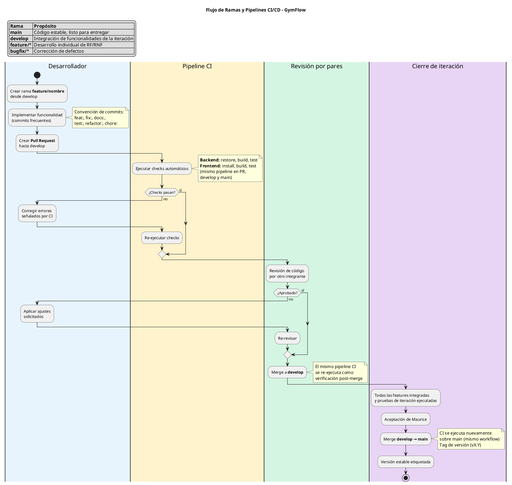

#diagrama

```plantuml

@startuml git-pipelines
title Flujo de Ramas y Pipelines CI/CD - GymFlow
skinparam shadowing false
skinparam defaultFontName Arial

legend top left
  |= Rama |= Propósito |
  | **main** | Código estable, listo para entregar |
  | **develop** | Integración de funcionalidades de la iteración |
  | **feature/*** | Desarrollo individual de RF/RNF |
  | **bugfix/*** | Corrección de defectos |
end legend

|#E8F4FD|Desarrollador|
start
:Crear rama **feature/nombre**
desde develop;

:Implementar funcionalidad
(commits frecuentes);
note right
  Convención de commits:
  feat:, fix:, docs:,
  test:, refactor:, chore:
end note

:Crear **Pull Request**
hacia develop;

|#FFF3CD|Pipeline CI|
:Ejecutar checks automáticos;
note right
  **Backend:** restore, build, test
  **Frontend:** install, build, test
  (mismo pipeline en PR,
  develop y main)
end note

if (¿Checks pasan?) then (sí)
else (no)
  |#E8F4FD|Desarrollador|
  :Corregir errores
  señalados por CI;
  |#FFF3CD|Pipeline CI|
  :Re-ejecutar checks;
endif

|#D5F5E3|Revisión por pares|
:Revisión de código
por otro integrante;

if (¿Aprobado?) then (sí)
else (no)
  |#E8F4FD|Desarrollador|
  :Aplicar ajustes
  solicitados;
  |#D5F5E3|Revisión por pares|
  :Re-revisar;
endif

|#D5F5E3|Revisión por pares|
:Merge a **develop**;
note right
  El mismo pipeline CI
  se re-ejecuta como
  verificación post-merge
end note

|#E8D5F5|Cierre de iteración|
:Todas las features integradas
y pruebas de iteración ejecutadas;

:Aceptación de Maurice;

:Merge **develop → main**;
note right
  CI se ejecuta nuevamente
  sobre main (mismo workflow)
  Tag de versión (vX.Y)
end note

:Versión estable etiquetada;
stop

@enduml

```
