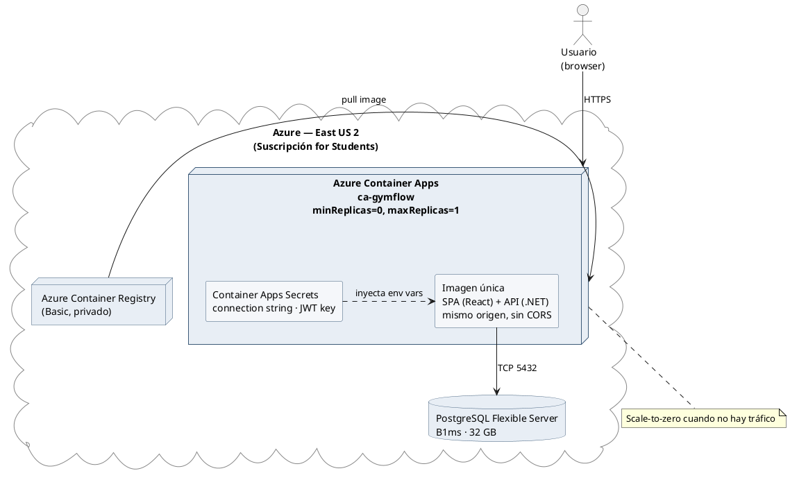

## Deploy a producción (manual)

El 21/05 se hizo el primer deploy de GymFlow a **Azure Container Apps**, dejando la app accesible públicamente por HTTPS. El deploy se ejecutó manualmente vía Azure CLI; la automatización vía GitHub Actions queda para la iteración 4.

**URL pública:** `https://ca-gymflow.gentlemeadow-5931333d.eastus2.azurecontainerapps.io`

### Arquitectura elegida

| Componente | Decisión | Por qué |
|---|---|---|
| Empaquetado | Single container (front + back en una imagen) | Sin CORS, deploy atómico, una sola URL |
| Hosting | Azure Container Apps, `minReplicas=0`, `maxReplicas=1` | Scale-to-zero: solo paga cuando hay tráfico (~$0.50/mes) |
| Base de datos | Azure Database for PostgreSQL Flexible Server (B1ms, 32 GB) | Datos persistentes, ~$13/mes |
| Registry | Azure Container Registry (Basic) | Imágenes privadas, ~$5/mes |
| Suscripción | Azure for Students ($100/año, sin tarjeta) | Crédito alcanza ~5-6 meses |
| Región | East US 2 | Catálogo completo, latencia ~130 ms desde UY |
| Secrets | Container Apps Secrets (no Key Vault) | Suficiente para el TFG, menos complejidad |

**Costo mensual estimado:** ~$18-20 (Postgres + ACR + Container Apps + Log Analytics dentro del free tier).

### Cambios de código necesarios

Mergeados en un PR previo al deploy: nuevo `Dockerfile`, cambios en `Program.cs` y nuevo `appsettings.Production.json`. Detalle en [[azure-deploy-design]] §3.

### Verificación post-deploy

- `GET /` devuelve el `index.html` del SPA.
- `POST /api/auth/login` con el admin seed devuelve JWT 200 OK.
- Login desde el browser funciona contra la URL de Azure (sin CORS, mismo origen).

*(captura del login funcionando contra la URL pública)*

### Documentación de referencia

- [[azure-deploy-design]] — spec ejecutable del deploy
- [[gymflow-azure-cheatsheet]] — comandos frecuentes
