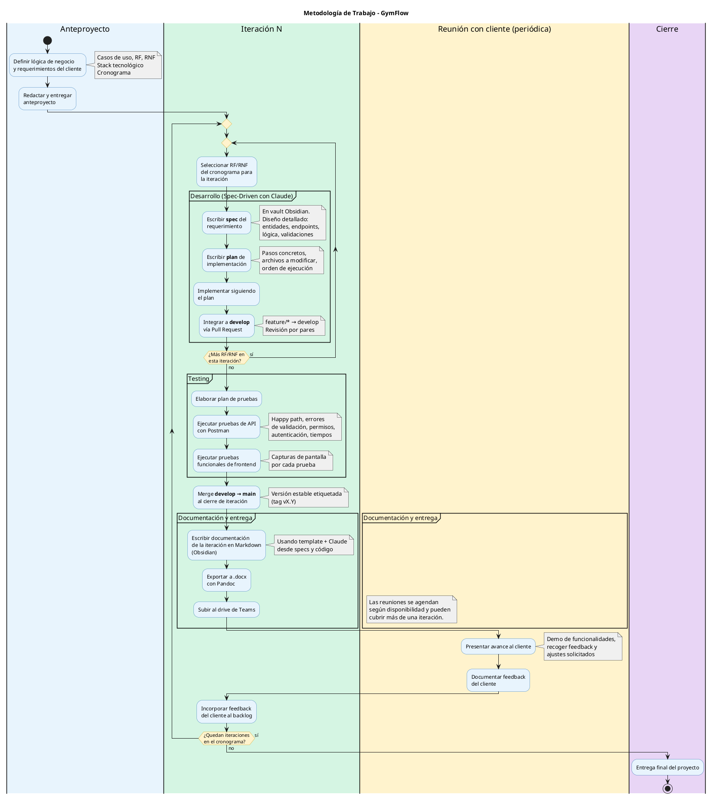
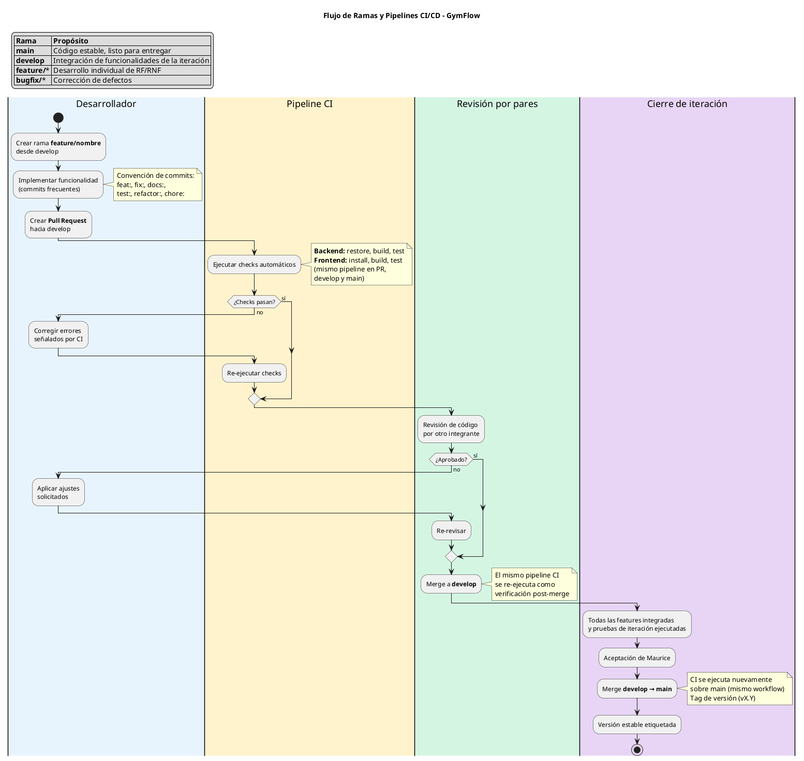

# DOCUMENTACIÓN ITERACIÓN 4

**Iteración 4 --- Fase de Construcción (30/05/2026 -- 13/06/2026)**

## Descripción general

La cuarta iteración estabilizó los módulos de inscripción a clases, gestión de empleados/profesores y horarios del portal. El cambio más significativo fue rediseñar la inscripción para que opere por horario individual (`HorarioClaseId`) en lugar de por clase genérica, permitiendo que un socio se inscriba a "Yoga, lunes 08:00" y "Yoga, miércoles 18:00" como inscripciones independientes. Se eliminó la lista de espera del alcance (si no hay cupo, se rechaza la inscripción). Se implementaron credenciales temporales autogeneradas con envío por email al crear empleados. RF-13 y RF-14 quedaron cubiertos por el sistema de roles y permisos configurables desde interfaz, sin requerir una relación fija profesor-clase.

En paralelo al trabajo de producto, esta iteración formalizó el **marco de trabajo** del equipo y se adoptó **Obsidian** como herramienta unificada para gestionar toda la documentación del proyecto.

## Tareas planificadas

Funcionalidades a implementar:

- **RF-10** — Inscripción a clase por horario individual con validación de cupo, duplicados y cuota al día.
- **RF-11** — Ver mis clases: vista "Mis Inscripciones" con día, hora y sala.
- **RF-12** — Gestionar empleados y profesores: credenciales temporales autogeneradas + email de bienvenida.
- **RF-13** — Profesor registra socios: cubierto por roles y permisos configurables desde interfaz.
- **RF-14** — Profesor gestiona sus clases: cubierto por roles y permisos configurables desde interfaz.

Requerimientos no funcionales:

- RNF-03 — Responsive: vistas del portal y admin optimizadas para móvil.
- RNF-11 — Log de auditoría en inscripciones, cancelaciones y creación de empleados.

Tareas técnicas de base:

- Migración de modelo: `InscripcionClase` referencia `HorarioClaseId` en lugar de `ClaseId`.
- Crear migración EF Core para el cambio de FK en `InscripcionesClase`.
- Implementar `GeneradorPassword` para credenciales temporales seguras.
- Optimizar `GetMisInscripcionesQuery` para evitar N+1 (conteo batch por horarios).
- Agregar `unidadIds` al `LoginResponse` y `/api/auth/me` para filtro de sede en frontend.
- Eliminar `CatalogoClasesPage` y ruta `/portal/clases` por redundancia.
- Mejorar `HorariosPortalPage` con filtro de sede obligatorio.
- Mejorar `HorariosPage` (admin) con split de clases solapadas y filtro de sede.
- Escribir tests unitarios de dominio (entidad `InscripcionClase`), de aplicación (commands y queries de inscripciones, empleados) y build de frontend.

## Marco de trabajo

Durante esta iteración se formalizó en un diagrama la metodología que el equipo venía aplicando desde iteraciones anteriores. El objetivo fue dejar explícito el ciclo de trabajo — desde la selección de requerimientos hasta la entrega al cliente — para alinear expectativas y servir como guía operativa para futuras iteraciones.

Si se quiere ver la imagen en ampliada: [marco-de-trabajo](https://fi365.sharepoint.com/:w:/s/ProyectoIntegrador-Febrero2026-N5A-TA-13-Notte-Compan-Acua/IQDt-0anuBMhQoK0aGZHrZViAQNTkhkAP8F9n5zeBxyGJsU?e=D9TkzS) (ruta en teams: Documents – Seguimiento - Iteración 4 – marco_de_trabajo.docx)

El ciclo arranca con la selección de los RF/RNF del cronograma asignados a la iteración. Por cada requerimiento se aplica un flujo **spec-driven**: primero se redacta una *spec* con el diseño detallado (entidades, endpoints, lógica, validaciones), luego un *plan* de implementación con pasos concretos y archivos a modificar, y recién después se escribe el código. La integración a `develop` se hace vía Pull Request con revisión por pares.

Una vez completados todos los requerimientos de la iteración, se ejecuta el bloque de **testing** (pruebas de API con Postman y pruebas funcionales de frontend con capturas), se mergea `develop → main` etiquetando una versión estable, y se redacta la documentación de cierre de iteración. La presentación al cliente es periódica y puede cubrir más de una iteración según su disponibilidad; el feedback recogido se documenta y se reinyecta al backlog de la siguiente iteración.

## Gestión de la documentación en Obsidian

A partir de esta iteración, **toda la documentación del proyecto se gestiona como un vault de Obsidian** sobre la carpeta `docs/` del repositorio. Los archivos Markdown son la fuente de verdad; los `.docx` se generan únicamente como artefactos finales de entrega usando Pandoc.

**Motivación del cambio:**

- **Trazabilidad** — specs, planes, diagramas y seguimiento viven en el mismo repositorio que el código, versionados con Git. Cada cambio en la documentación queda registrado junto al commit que lo motiva.
- **Documentos enlazados** — Obsidian permite navegar entre specs, planes y diagramas con enlaces internos, manteniendo coherencia entre los requerimientos escritos y su implementación.
- **Edición ágil** — Markdown plano evita el ruido de formato de Word durante la redacción y revisión iterativa.
- **Diagramas como código** — los diagramas PlantUML se escriben en bloques de código dentro de los `.md`, se versionan como cualquier fuente y se diffean en los Pull Requests.
- **Encaje con flujo spec-driven** — el asistente de IA (Claude) consume y produce archivos `.md` directamente, sin transformaciones intermedias.

**Estructura del vault:**

| Carpeta | Contenido |
|---|---|
| `docs/specs/` | Specs por requerimiento (RF/RNF) con diseño detallado. |
| `docs/plans/` | Planes de implementación derivados de cada spec. |
| `docs/diagramas/` | Diagramas PlantUML (marco de trabajo, pipelines, actividad). |
| `docs/seguimiento/` | Documentación de cierre por iteración. |
| `docs/deploy/` | Notas de configuración de despliegue y CI/CD. |

**Flujo de entrega:** una vez completada la documentación de la iteración en Markdown, se exporta a `.docx` mediante un script con Pandoc (`export-doc.ps1`), que renderiza los bloques PlantUML como imágenes embebidas y produce el documento final que se sube al drive de Teams.

## Flujo de ramas y pipelines CI/CD

Como parte del trabajo de esta iteración se formalizó también el flujo de ramas y la integración continua. Este diagrama complementa el marco de trabajo general y se relaciona directamente con la automatización del deploy implementada en esta iteración (detalle completo en el documento de deploy de iteración 4).

Si se quiere ver la imagen en ampliada: [diagrama_git_pipelines](https://fi365.sharepoint.com/:w:/s/ProyectoIntegrador-Febrero2026-N5A-TA-13-Notte-Compan-Acua/IQAifhTeSs_QQJ7lsiA3oGVAAWJU3I5_MWxWdjUMDJcqK0s?e=SFxilG) (ruta en teams: Documents – Seguimiento - Iteración 4 – diagrama_git_pipelines.docx)

El flujo distingue cuatro tipos de ramas: **`main`** mantiene el código estable y listo para entregar, **`develop`** integra las funcionalidades de la iteración en curso, y las ramas **`feature/*`** y **`bugfix/*`** alojan el desarrollo individual de cada requerimiento o corrección. Cada PR dispara el mismo pipeline de CI (backend con `restore`/`build`/`test`, frontend con `install`/`build`/`test`), que se re-ejecuta como verificación tras cada merge a `develop` y a `main`. El cierre de iteración consolida todo el trabajo aceptado, mergea `develop → main` y etiqueta una versión estable.

## ¿Qué se implementó?

Funcionalidades implementadas:

| **Requerimiento** | **Caso de uso** | **Estado** | **Detalle** |
|-|-|-|-|
| RF-10 | CU-02 — Inscripción a Clase | Completado | Inscripción por `HorarioClaseId` con validación de cupo, duplicados (RN-09), cuota al día y clase activa. Email de confirmación al socio. Auditoría de inscripción y cancelación. Lista de espera descartada: si no hay cupo se bloquea. |
| RF-11 | CU-02 — Ver Mis Clases | Completado | Página "Mis Inscripciones" muestra clase, sede, día, hora, sala, capacidad y ocupación. Query optimizada con conteo batch (2 queries en vez de N+1). |
| RF-12 | CU-07 — Gestión de Empleados | Completado | Al crear empleado ya no se solicita password manual. El sistema autogenera una contraseña temporal segura y la envía por email con plantilla de bienvenida. Auditoría registra si el email fue enviado o falló. |
| RF-13 | CU-07 — Profesor registra socios | Completado | Cubierto por roles y permisos configurables desde interfaz. Un admin puede crear un rol "Profesor" con permisos de escritura en el módulo Socios. |
| RF-14 | CU-07 — Profesor gestiona sus clases | Completado | Cubierto por roles y permisos configurables desde interfaz. El admin asigna permisos por módulo (Clases.Lectura, Clases.Escritura, etc.) al rol del profesor. |
| RF-09 (mejora) | CU-06 — Horarios admin | Completado | Filtro de sede obligatorio en calendario de horarios del admin. Split visual de clases solapadas en la misma franja horaria. |

Requerimientos no funcionales implementados:

| **Requerimiento** | **Caso de uso** | **Estado** | **Detalle** |
|-|-|-|-|
| RNF-11 | Auditoría | Completado | Inscripciones y cancelaciones registran audit log con usuario, timestamp y detalle. Creación de empleados audita envío de email. |
| RNF-03 | Responsive | Completado | Vistas del portal de socios (horarios, mis inscripciones) y vistas de admin (horarios, clases) optimizadas para móvil. |
| RNF-05 | Seguridad | Completado | Controller de inscripciones usa `[Authorize]` con validación de ownership. Contraseñas temporales generadas con criterios de seguridad (mayúsculas, minúsculas, números, especiales). |

## Pantallas implementadas

**Pantalla Horarios Portal del Socio (rediseñada)**

*(captura de pantalla)*

**Ruta:** /portal/horarios

**Descripción:** Vista principal de inscripción a clases del socio. Muestra horarios agrupados por día con nombre de clase, instructor, horario, sala y cupo disponible. El socio se inscribe a un horario específico (no a la clase genérica). Filtro de sede obligatorio. Botón "Inscribirme" deshabilitado con texto "Cupo lleno" cuando no hay cupos disponibles.

**Pantalla Mis Inscripciones (mejorada)**

*(captura de pantalla)*

**Ruta:** /portal/mis-inscripciones

**Descripción:** Listado de inscripciones activas del socio con día de semana, hora de inicio/fin, sala, nombre de clase, instructor y sede. Opción de cancelar inscripción con confirmación.

**Pantalla Calendario de Horarios Admin (mejorada)**

*(captura de pantalla)*

**Ruta:** /admin/horarios

**Descripción:** Grilla semanal de horarios con filtro de sede obligatorio. Mejora visual con split de clases solapadas en la misma franja horaria para evitar superposición de bloques.

**Pantalla Nuevo Empleado (modificada)**

*(captura de pantalla)*

**Ruta:** /admin/usuarios/nuevo

**Descripción:** Formulario de alta de empleado sin campo de contraseña. El sistema autogenera credenciales temporales y las envía por email al correo del nuevo empleado.

## Estructura de API --- endpoints implementados

| **Método** | **Endpoint** | **Descripción** |
|-|-|-|
| POST | `/api/inscripciones` | Inscribir socio a un horario (`{ horarioClaseId }`). Valida cupo, duplicados, cuota y clase activa. |
| GET | `/api/inscripciones/mis-inscripciones` | Obtener inscripciones del socio autenticado con día, hora, sala, capacidad y ocupación. |
| DELETE | `/api/inscripciones/{id}` | Cancelar inscripción propia del socio (auditoría + liberación de cupo). |
| POST | `/api/empleados` | Crear empleado sin password manual. Autogenera contraseña temporal y envía email. |
| GET | `/api/empleados` | Listar empleados (sin cambios funcionales en esta iteración). |
| GET | `/api/horarios` | Obtener horarios con conteo de inscripciones activas por horario. |
| GET | `/api/auth/me` | Retorna datos del usuario autenticado incluyendo `unidadIds` para filtro de sede. |
| POST | `/api/auth/login` | Login con `unidadIds` en la respuesta. |

## Caso de uso extendido --- Iteración 4

### CU-02: Inscripción a Clase (por horario)

| *Campo* | |
|-|-|
| *Nombre* | Inscripción a Clase por Horario |
| *Actor principal* | Socio |
| *Precondición* | Socio autenticado, estado Activo, cuota al día. Existen clases con horarios y cupo disponible. |
| *Postcondición* | Socio inscripto al horario. Cupo ocupado incrementado. Inscripción visible en "Mis Inscripciones". Email de confirmación enviado. Auditoría registrada. |

**Flujo principal:**

1. Socio accede a "Horarios" en el portal.
2. Sistema muestra horarios agrupados por día con nombre de clase, instructor, hora, sala y cupos disponibles.
3. Socio selecciona filtro de sede (obligatorio).
4. Socio selecciona un horario con cupo disponible → "Inscribirme".
5. Sistema verifica: (a) no inscripto previamente a ese horario (RN-09), (b) cupo disponible, (c) cuota al día en la unidad de la clase, (d) clase activa.
6. Sistema registra inscripción con `HorarioClaseId`, actualiza conteo de cupo, genera log de auditoría.
7. Sistema envía email de confirmación al socio con día, hora y sala.
8. Horario actualiza cupo visible. La inscripción aparece en "Mis Inscripciones".

**Flujos alternativos:**

- **Desinscripción:** Socio accede a "Mis Inscripciones" → "Cancelar inscripción" → confirma → sistema cancela inscripción, libera cupo, registra auditoría.
- **Mismo curso en otro horario:** Socio puede inscribirse a la misma clase en un horario distinto (ej. Yoga lunes y Yoga miércoles). RN-09 solo impide duplicar el mismo horario.

**Flujos de excepción:**

- **E1 — Sin cupo:** "Este horario no tiene cupos disponibles." Botón deshabilitado con texto "Cupo lleno".
- **E2 — Inscripción duplicada:** "Ya estás inscripto en este horario."
- **E3 — Clase cancelada:** No permite nuevas inscripciones a horarios de clases canceladas.
- **E4 — Cuota vencida:** "No podés inscribirte con cuota vencida en esta sede."

### CU-07: Gestión de Empleados y Profesores (credenciales temporales)

| *Campo* | |
|-|-|
| *Nombre* | Alta de Empleado con Credenciales Temporales |
| *Actor principal* | Administrador |
| *Precondición* | Admin autenticado con permisos en módulo Empleados. |
| *Postcondición* | Empleado creado con estado Activo. Contraseña temporal generada. Email de bienvenida enviado con credenciales. Auditoría registrada. |

**Flujo principal:**

1. Admin accede a "Empleados y Profesores" → "Nuevo".
2. Sistema presenta formulario sin campo de contraseña.
3. Admin completa nombre, correo, teléfono, rol y espacio asignado.
4. Sistema genera contraseña temporal segura con `GeneradorPassword`.
5. Sistema crea el empleado, envía email de bienvenida con las credenciales temporales.
6. Auditoría registra la creación y el resultado del envío de email (exitoso/fallido).

**Flujos de excepción:**

- **E1 — Correo duplicado:** "Ya existe un usuario registrado con ese correo."
- **E2 — Error envío email:** Se registra el fallo en auditoría. Admin puede reenviar manualmente.

## CI/CD: auto-deploy a Azure en push a main

A partir de esta iteración el deploy a producción es automático. Cada merge a `main` (vía PR desde `develop`) dispara un workflow de GitHub Actions que corre tests, builduea la imagen, la pushea a ACR y actualiza el Container App. Reemplaza el procedimiento manual de la iteración 3.

**Pipeline (`.github/workflows/deploy.yml`)**

Tres jobs encadenados:

1. **Tests** — backend (`dotnet test`) y frontend (`npm run build` + `vitest run`). Bloquea el deploy si fallan.
2. **Deploy** — Se arma la imagen Docker de la app, se sube a Azure con una etiqueta única del commit, y se le dice a Azure que use esa nueva versión. Azure la levanta primero, verifica que ande, y recién ahí apaga la anterior, así la app nunca queda caída. Si algo falla en las pruebas posteriores, vuelve sola a la versión anterior.
3. **Smoke test** — polling de `GET /` hasta recibir 200 OK (hasta 30 intentos cada 5 s). Si no responde, el job falla y dispara rollback automático a la revisión anterior.

**Setup realizado**

- **Service Principal `sp-gymflow-cicd`** con rol Contributor scoped solo al Resource Group `rg-gymflow`.
- **GitHub Secrets:** `AZURE_CREDENTIALS` (JSON del SP).
- **GitHub Variables:** `AZURE_RG`, `AZURE_ACR_NAME`, `AZURE_ACR_LOGIN_SERVER`, `AZURE_ACA_APP`.
- **Branch protection en `main`:** require PR, require status checks (test job), block force pushes.

**Iteraciones del pipeline durante la iteración**

- Workflow inicial (07/06).
- Rollback automático ante smoke test fallido + simplificación del job de tests (sin Postgres, no hacían falta integration tests en el pipeline).
- Workflow auxiliar `workflow_dispatch` para activar SMTP en el Container App sin re-deployar.
- Fix: el `az acr build` quedó bloqueado por límites de la suscripción Students; se reemplazó por `docker build` + `docker push` corriendo directo en el runner.

**Documentación de referencia**

- [SETUP-CICD](https://fi365.sharepoint.com/:w:/s/ProyectoIntegrador-Febrero2026-N5A-TA-13-Notte-Compan-Acua/IQBF2znQ8mwiQp7YYxKe95ZIAZbZ9N_ElwL8QiJSaJ5ULak?e=n3bsYx) — checklist setup manual - Service Principal + GitHub Secrets/Variables (ruta teams: Documents – Seguimiento - Iteración 4 - SETUP-CICD). Detalle local en [[deploy-iteracion-4]].

## Reuniones con el cliente

No se realizaron reuniones formales con el cliente durante esta iteración. Se trabajó sobre los ajustes y sugerencias recopilados en la reunión de la iteración 3.

Funcionalidades presentadas:

- Pendiente de presentación en próxima reunión.

Sugerencias y ajustes solicitados:

- Los ajustes de la reunión anterior (inscripción desde cronograma, notificaciones de bienvenida) fueron incorporados en esta iteración.

## Pruebas automatizadas (xUnit)

Además de las pruebas de API con Postman, los módulos de esta iteración cuentan con pruebas automatizadas hechas en código (xUnit + Moq) en `backend/tests/**`, ejecutadas con `dotnet test` desde `backend/`. Suite en verde (0 fallos). Cobertura agregada en esta iteración:

**Inscripción a clases por horario (RF-10 / RF-11):**

- *Application:* con cupo disponible la inscripción se concreta, envía el email de confirmación y registra auditoría; sin cupo se rechaza; la cancelación valida que la inscripción pertenezca al socio que la solicita y audita la baja; "Mis Inscripciones" obtiene el conteo de cupos con una sola consulta batch (sin problema N+1).

**Gestión de empleados y profesores (RF-12):**

- *Application:* el alta valida nombre, correo no duplicado y rol (existente y distinto de Socio), asigna las unidades del empleado y registra auditoría; la edición repite esas validaciones sobre un empleado existente y audita; el cambio de contraseña exige un largo mínimo y persiste el hash (nunca el texto plano); la baja es lógica y un empleado no puede darse de baja a sí mismo; el listado de empleados aplica los filtros por unidad.
- *Common:* el generador de contraseñas temporales produce contraseñas que cumplen el largo y la composición requerida (mayúsculas, minúsculas, números y caracteres especiales) y no genera valores repetidos.

RF-13 y RF-14 quedan cubiertos por las pruebas de roles y permisos de la iteración 2 (`RequierePermisoAttributeTests`, commands de `Roles/`), ya que el profesor se modela como un rol configurable con permisos por módulo.

El inventario completo de las pruebas automatizadas de las iteraciones 1 a 4, clase por clase, está en [[pruebas-automatizadas-it1-4]].

## Pruebas de API realizadas con Postman

Se implementaron tests automatizados con Postman para los módulos modificados en esta iteración, validando los cambios en inscripciones (por horario) y creación de empleados (sin password manual).

### Inscripciones por Horario (RF-10/RF-11) — 7 tests

| **Test** | **Método** | **Endpoint** | **Validación** |
|-|-|-|-|
| 200 - Login como Socio | POST | `/api/auth/login` | Autenticación de socio con `unidadIds` en respuesta |
| 200 - Inscribir socio a horario | POST | `/api/inscripciones` | Inscripción exitosa con `{ horarioClaseId }`, estructura `InscripcionClaseDto` |
| 409 - Inscripción duplicada al mismo horario | POST | `/api/inscripciones` | Rechazo por RN-09: ya inscripto en ese horario |
| 404 - Inscribir a horario inexistente | POST | `/api/inscripciones` | Error 404 con horario inexistente |
| 200 - Obtener mis inscripciones con día/hora/sala | GET | `/api/inscripciones/mis-inscripciones` | Array con inscripciones del socio, incluye `diaSemana`, `horaInicio`, `horaFin`, `sala` |
| 204 - Cancelar inscripción | DELETE | `/api/inscripciones/{id}` | Cancelación exitosa, cupo liberado |
| 404 - Cancelar inscripción inexistente | DELETE | `/api/inscripciones/{id}` | Error 404 con ID inexistente |

### Empleados (RF-12) — 4 tests

| **Test** | **Método** | **Endpoint** | **Validación** |
|-|-|-|-|
| 201 - Crear empleado sin password | POST | `/api/empleados` | Empleado creado exitosamente sin campo password en request |
| 409 - Crear empleado con correo duplicado | POST | `/api/empleados` | Rechazo por correo ya registrado |
| 200 - Listar empleados | GET | `/api/empleados` | Array con empleados registrados |
| 401 - Crear empleado sin autenticación | POST | `/api/empleados` | Rechazo sin token |

### Resumen de resultados

| **Módulo** | **Tests** | **Resultado** |
|-|-|-|
| Auth (login + me) | 2 | Pasaron |
| Inscripciones (RF-10/RF-11) | 7 | Pasaron |
| Empleados (RF-12) | 4 | Pasaron |

### Correcciones detectadas durante testing

Durante la ejecución de los tests de Postman se detectaron y corrigieron los siguientes defectos:

| **Defecto** | **Causa raíz** | **Corrección aplicada** |
|-|-|-|
| `UnidadesController` devolvía 200 sin autenticación (debía ser 401/403) | El controller no tenía `[Authorize]` ni `[RequierePermiso]`. Era el único módulo del enum `Modulo` sin protección de acceso. | Se agregó `[Authorize]` a nivel de controller y `[RequierePermiso(Modulo.Unidades, Operacion.Lectura)]` al endpoint `GET /api/unidades`. |
| `ClaseDto` no incluía `inscripcionesActivas` | El DTO de clases fue diseñado antes de la migración a inscripciones por horario. El campo nunca se agregó al DTO, aunque el conteo existía a nivel de `HorarioClaseDto`. | Se agregó el campo `InscripcionesActivas` al `ClaseDto` y se actualizaron `GetClasesQuery` y `GetClaseByIdQuery` para calcular la suma de inscripciones activas de todos los horarios de la clase. En `CreateClaseCommand` y `ReactivarClaseCommand` se retorna 0 (clase nueva/sin inscripciones). En `UpdateClaseCommand` se calcula el total real. |
| Test RNF-01 fallaba al loguear empleado restringido (401) | `CrearEmpleadoRequest` ya no acepta password (it4: credenciales autogeneradas). El test intentaba loguear con un password hardcodeado que no coincidía con el generado por el sistema. | Se agregó un paso intermedio `PATCH /api/empleados/{id}/password` en el setup de RNF-01 para asignar un password conocido al empleado antes del login. |
| Test `unidadIds` fallaba para admin (expected array, got null) | `unidadIds` es `null` para usuarios que no son socios (admin, empleados), ya que solo los socios tienen unidades asignadas. | Se actualizó la aserción en los tests de login y `/auth/me` para aceptar `null` (admin/empleados) o `array` (socios). |

## Pruebas funcionales de frontend

### Prueba 4.1 --- Inscripción a horario específico desde portal del socio

*(captura de pantalla)*

**Pasos:**

1. Iniciar sesión como socio.
2. Navegar a "Horarios" en el portal.
3. Seleccionar sede en el filtro obligatorio.
4. Seleccionar un horario con cupo disponible (ej. "Yoga, Lunes 08:00-09:00") y hacer clic en "Inscribirme".

**Resultado esperado:** La inscripción se registra, el cupo disponible se decrementa, y la inscripción aparece en "Mis Inscripciones" con día, hora y sala.

**Descripción:** Se verifica que la inscripción opera por horario individual. El socio se inscribe a "Yoga, lunes 08:00" y puede luego inscribirse a "Yoga, miércoles 18:00" como inscripción separada.

### Prueba 4.2 --- Inscripción bloqueada por cupo lleno

*(captura de pantalla)*

**Pasos:**

1. Navegar a "Horarios" como socio.
2. Localizar un horario que no tiene cupos disponibles.

**Resultado esperado:** El botón "Inscribirme" aparece deshabilitado con texto "Cupo lleno". No se permite la inscripción.

**Descripción:** Se verifica que cuando un horario alcanza su capacidad máxima, el sistema bloquea la inscripción sin ofrecer lista de espera.

### Prueba 4.3 --- Cancelación de inscripción desde Mis Inscripciones

*(captura de pantalla)*

**Pasos:**

1. Navegar a "Mis Inscripciones" como socio.
2. Seleccionar una inscripción activa que muestra día, hora y sala.
3. Hacer clic en "Cancelar inscripción".

**Resultado esperado:** La inscripción se elimina, el cupo se libera y el horario vuelve a mostrar cupo disponible en "Horarios".

**Descripción:** Se verifica el flujo de cancelación con la nueva estructura por horario, incluyendo la actualización correcta del conteo de cupo.

### Prueba 4.4 --- Crear empleado sin password manual

*(captura de pantalla)*

**Pasos:**

1. Iniciar sesión como administrador.
2. Navegar a Empleados → Nuevo.
3. Completar formulario con nombre, correo, teléfono, rol y espacio. El campo de contraseña no aparece.
4. Hacer clic en "Guardar".

**Resultado esperado:** El empleado se crea exitosamente. El sistema genera una contraseña temporal y envía un email de bienvenida con las credenciales.

**Descripción:** Se verifica que el formulario ya no solicita password manual y que el sistema autogenera credenciales temporales seguras enviadas por email.

### Prueba 4.5 --- Filtro de sede obligatorio en horarios del portal

*(captura de pantalla)*

**Pasos:**

1. Iniciar sesión como socio asignado a ambas sedes.
2. Navegar a "Horarios" en el portal.
3. Observar que se requiere seleccionar una sede antes de ver los horarios.

**Resultado esperado:** Los horarios se filtran por la sede seleccionada. Solo se muestran clases de la sede elegida.

**Descripción:** Se verifica que el filtro de sede es obligatorio y funcional, mostrando solo los horarios correspondientes a la unidad seleccionada.

### Prueba 4.6 --- Split visual de clases solapadas en horarios admin

*(captura de pantalla)*

**Pasos:**

1. Iniciar sesión como administrador.
2. Navegar a "Horarios" en el panel de admin.
3. Seleccionar una sede que tiene clases con horarios solapados en el mismo día.

**Resultado esperado:** Las clases solapadas se muestran con split visual (bloques divididos) para evitar superposición ilegible.

**Descripción:** Se verifica la mejora de UX en la grilla de horarios del admin cuando hay múltiples clases programadas en la misma franja horaria.

## Registro de tiempos

**Desarrollo -- tiempo por commit**

| **Hash** | **Fecha** | **Descripción** | **Tiempo (hs)** |
|:--:|----|----|:--:|
| 37e70b5 | 2026-05-31 | Documentacion completa en Obsidian | 1.50 |
| 0c545ed | 2026-06-04 | Docs: spec y plan IT4 (inscripciones/empleados) | 1.25 |
| 0818dab | 2026-06-04 | Inscripcion con cuota, lista espera y email | 1.00 |
| b4dba9f | 2026-06-04 | Cancelar inscripcion con auditoria | 1.00 |
| 729482c | 2026-06-04 | Credenciales temporales + email crear empleado | 1.00 |
| 2228f43 | 2026-06-04 | Catalogo de clases con filtros en portal | 1.00 |
| 15edf9e | 2026-06-04 | Horarios con filtro sede + split solapados | 1.00 |
| 2461446 | 2026-06-04 | Fix N+1 en GetMisInscripcionesQuery | 1.00 |
| 84a6e50 | 2026-06-04 | Preparacion MFA y OAuth para IT5 | 1.50 |
| d1fe117 | 2026-06-05 | Mejoras IT4 clases y horarios | 1.00 |
| 2cf36f6 | 2026-06-06 | Correcciones con tests Postman + doc IT4 | 1.50 |
| d0e59cc | 2026-06-07 | CI: workflow auto-deploy Azure Container Apps | 0.50 |
| fdeb3a0 | 2026-06-07 | Docs: setup pipeline deploy Azure | 0.75 |
| 04b3019 | 2026-06-09 | CI: rollback automatico en deploy fallido | 0.50 |
| a4dbc6b | 2026-06-09 | Fix: re-agregar validacion cuota al inscribir | 0.75 |
| 1109ea8 | 2026-06-09 | Perf: eliminar N+1 en GetClasesQuery | 1.00 |
| 3fffb25 | 2026-06-09 | Merge PR #21: CI/CD deploy Azure | 0.25 |
| aea2968 | 2026-06-12 | Docs: spec y plan login Google (IT5) | 1.25 |
| 94322c5 | 2026-06-12 | Login con Google: comando, endpoint y boton UI | 1.00 |
| d79fb7c | 2026-06-12 | Email confirmacion al marcar cuota pagada | 1.00 |
|  |  | **Subtotal Desarrollo** | **19.8** |

**Otras actividades**

| **Actividad** | **Tiempo (hs)** |
|----|:--:|
| Plan de testing - Frontend | 1 |
| Ejecución plan de testing - Frontend | 2 |
| Planificación Plan de testing - Endpoints en Postman | 1 |
| Ejecución Plan de testing - Endpoints en Postman | 2 |
| Implementación CI/CD en main | 5 |
| Documentación | 10 |
| **Subtotal Otras Actividades** | **21** |

**TOTAL HORAS - Iteración 4: 40.8**
